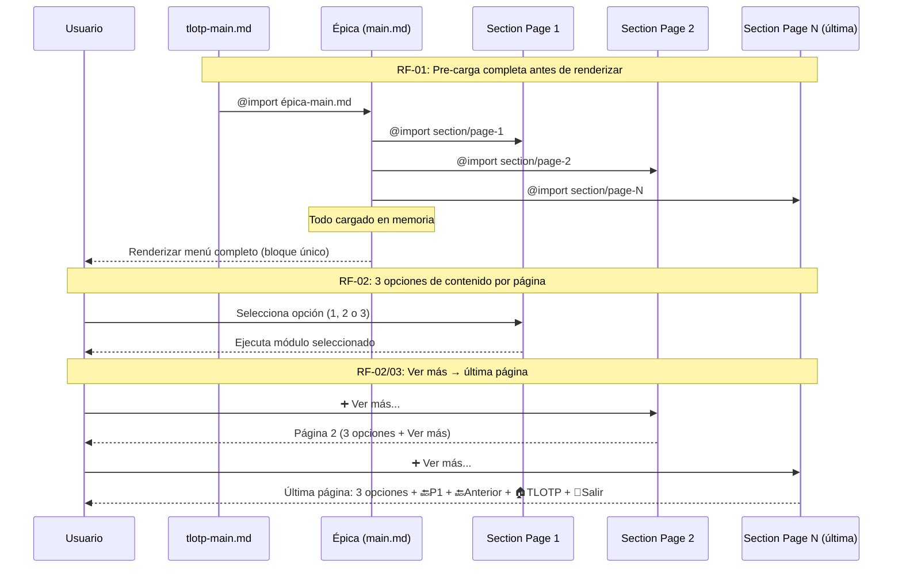

# Design — TLOTP UX & Lore Improvements

**Proyecto**: The Lord of the Prompt (TLOTP) v4.0.0
**Aventura**: Mejoras de UX, paginación, modularización y lore
**Tipo**: Nueva feature en proyecto existente
**Fecha**: 2026-03-18

---

## Arquitectura

- **Tipo de app**: Prompt Engineering / Interactive CLI Tool (Markdown-based)
- **Patrón**: Modular Prompt Architecture — Separation of Concerns via @imports composition
- **Módulos afectados**: todos los `*-main.md` + `aragorn-main.md` + `gandalf/sections/10-module-forge-team.md`
- **Frontend**: No

---

## Diagrama de Flujo

---

## Componentes

### 1. Sistema de Paginación Universal

- **Responsabilidad**: Gestionar menús paginados con 3 opciones de contenido + navegación completa en última página
- **Dependencias**: Todos los `*-main.md` que usan paginación
- **Interfaz**: Patrón AskUserQuestion estándar reutilizable (3 opciones + "Ver más" + navegación última página)

### 2. Sistema de Pre-carga de Módulos

- **Responsabilidad**: Garantizar que todos los @imports de un prompt se resuelven antes de cualquier interacción con el usuario (render-blocking loading)
- **Dependencias**: Todos los `*-main.md` con @imports
- **Interfaz**: Instrucción explícita de carga en sección INICIO de cada prompt principal

### 3. Sistema de Personajes Aragorn (ampliado)

- **Responsabilidad**: Tabla de asignación personaje↔rol extensible, con rotación anti-repetición por sesión. Nuevas entradas: Thorin Escudo de Roble (CI/CD), Ents del lore (infraestructura)
- **Dependencias**: `aragorn-main.md` · todos los módulos de Aragorn
- **Interfaz**: Tabla de mapping en `aragorn-main.md` sección "Lore al instalar y listar agentes"

### 4. G10 Team Composer (Gandalf)

- **Responsabilidad**: Proponer Agent Team al finalizar un SDD con todos los agentes necesarios según complejidad, siempre con `multi-agent-coordinator` como lead
- **Dependencias**: `gandalf/sections/10-module-forge-team.md` · `aragorn-main.md` · `.claude/teams/`
- **Interfaz**: Invoca `03-module-team-builder.md` de Aragorn con configuración pre-rellenada

---

## Decisiones Técnicas (ADR-lite)

### ADR-01 — Paginación: 3 opciones de contenido vs 2

**Elegido**: 3 opciones de contenido por página + "Ver más"
**Descartado**: 2 opciones (actual) · paginación dinámica
**Motivo**: AskUserQuestion permite máx 4 opciones. Con 3 de contenido + "Ver más" se aprovecha al máximo el espacio sin sacrificar la opción de navegación.
**Consecuencias**: Todos los `*-main.md` deben actualizarse. Gain: más densidad de contenido por pantalla.

### ADR-02 — Pre-carga: instrucción explícita vs lazy load

**Elegido**: Instrucción explícita al inicio de cada `main.md` para que Claude resuelva todos los @imports antes de mostrar el banner
**Descartado**: Carga incremental (comportamiento actual)
**Motivo**: El lazy load genera UX inconsistente — el usuario ve contenido parcial. La instrucción explícita garantiza render completo en bloque único.
**Consecuencias**: Ligero aumento del tiempo de carga inicial. Gain: experiencia de usuario completamente fluida.

### ADR-03 — Umbral de modularización: 250 líneas

**Elegido**: 250 líneas como umbral para proponer split de ficheros
**Descartado**: 100 líneas (demasiado agresivo) · sin umbral
**Motivo**: Coherente con `ARCHITECTURE.md` ("< 250 líneas ideal por módulo"). Permite módulos con contenido suficiente sin fragmentar en exceso.
**Consecuencias**: Aplica a `aragorn-main.md`, `gandalf-main.md` y secciones extensas de Celebrimbor.

---

## Seguridad

- Sin datos sensibles en prompts (no credenciales hardcodeadas)
- WebFetch solo a URLs de la whitelist definida en `docs-sources.md`
- Cambios en `aragorn-main.md` no deben exponer rutas de sistema del usuario
- Los @imports solo referencian rutas relativas del repositorio

---

## Riesgos Técnicos

| Riesgo | Prob. | Impacto | Mitigación |
|--------|-------|---------|------------|
| Rotura de menús al cambiar paginación en todas las épicas | Media | Alto | Tests manuales en cada épica tras el cambio |
| Regresión en sistema de personajes de Aragorn tras ampliar tabla | Baja | Medio | Tabla centralizada en un único lugar en `aragorn-main.md` |
| `.md` > 250 líneas con dependencias circulares que impiden modularización | Baja | Bajo | Revisión manual caso a caso, no forzar split si introduce complejidad |
