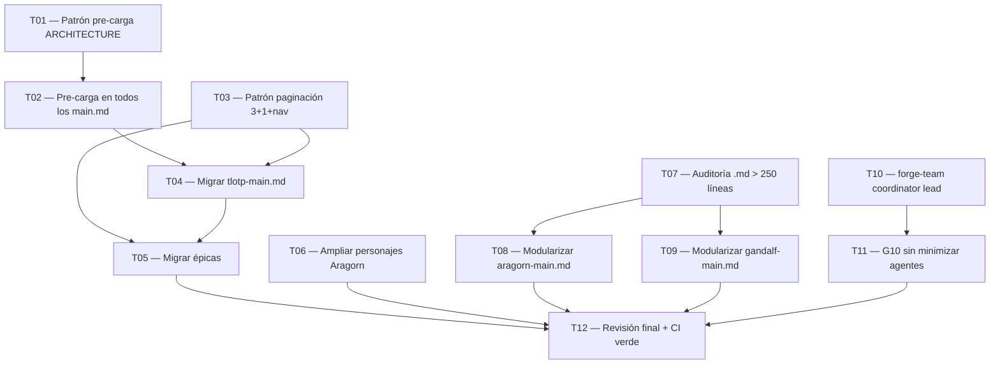

# Tasks — TLOTP UX & Lore Improvements

**Proyecto**: The Lord of the Prompt (TLOTP) v4.0.0
**Aventura**: Mejoras de UX, paginación, modularización y lore
**Fecha**: 2026-03-18

---

## Bloque 1 — Pre-carga de módulos (RF-01)

### T01 — Documentar patrón de pre-carga en ARCHITECTURE.md [S]

**Depende de**: ninguna

Definir y documentar la instrucción estándar de pre-carga que debe incluirse en cada `*-main.md`. Especifica que Claude debe resolver todos los @imports antes de mostrar el banner o cualquier contenido al usuario.

**Criterios de aceptación**:
- [ ] ARCHITECTURE.md incluye sección "Patrón de Pre-carga" con instrucción exacta a copiar
- [ ] El patrón especifica que la instrucción debe ir antes de la sección INICIO ÉPICO

---

### T02 — Aplicar pre-carga a todos los *-main.md [L]

**Depende de**: T01

Añadir la instrucción de pre-carga definida en T01 a los 8 ficheros `*-main.md` del proyecto: `tlotp-main.md`, `aragorn-main.md`, `gandalf-main.md`, `palantir-main.md`, `bardo-main.md`, `celebrimbor-main.md`, `ents-main.md`.

**Criterios de aceptación**:
- [ ] Los 8 ficheros contienen la instrucción de pre-carga al inicio
- [ ] El banner y los menús se renderizan en un único bloque sin carga incremental visible
- [ ] Ningún @import referenciado en los menús genera carga lazy

---

## Bloque 2 — Nueva paginación (RF-02, RF-03)

### T03 — Diseñar patrón estándar de paginación 3+1+navegación [S]

**Depende de**: ninguna

Definir el patrón de menú paginado actualizado: 3 opciones de contenido por página + "Ver más", y última página con navegación completa (🔙 Página 1 · 🔙 Menú anterior · 🏠 TLOTP principal · 🚪 Salir). Documentar en ARCHITECTURE.md.

**Criterios de aceptación**:
- [ ] ARCHITECTURE.md incluye sección "Patrón de Paginación" con el JSON de AskUserQuestion estándar para páginas intermedias y última página
- [ ] El patrón especifica exactamente las 4 opciones de la última página

---

### T04 — Migrar tlotp-main.md al nuevo patrón de paginación [M]

**Depende de**: T03

Actualizar `tlotp-main.md` para usar 3 opciones de contenido por página y navegación completa en la última página (actualmente tiene 2 opciones + ver más + salir).

**Criterios de aceptación**:
- [ ] Las pantallas 1 y 2 muestran 3 opciones de contenido + "Ver más"
- [ ] La última pantalla incluye las 4 opciones de navegación definidas en T03
- [ ] El routing existente no se rompe

---

### T05 — Migrar épicas al nuevo patrón de paginación [L]

**Depende de**: T03, T04

Actualizar los menús paginados de todas las épicas: `aragorn-main.md`, `gandalf-main.md`, `palantir/sections/00-menu-principal.md`, `bardo/sections/00-module-analyze.md`, `celebrimbor/sections/02-menu-principal.md`, `ents/sections/00-menu-principal.md`.

**Criterios de aceptación**:
- [ ] Todos los menús paginados de todas las épicas muestran 3 opciones de contenido por página
- [ ] Todas las últimas páginas incluyen las 4 opciones de navegación estándar
- [ ] El CI (markdownlint + internal links) pasa en verde

---

## Bloque 3 — Sistema de personajes Aragorn (RF-05)

### T06 — Ampliar tabla de personajes en aragorn-main.md [M]

**Depende de**: ninguna

Ampliar la tabla de asignación personaje↔rol en `aragorn-main.md` (sección "Lore al instalar y listar agentes") con: ⛏️ Thorin Escudo de Roble (CI/CD · pipelines · semver), 🌳 Bárbol (infrastructure · monitoring), 🌲 Quickbeam (deployment · cloud), y cualquier otro Ent del lore relevante. Añadir lógica de rotación anti-repetición: si un personaje ya fue usado en la sesión, usar el siguiente disponible para ese rol.

**Criterios de aceptación**:
- [ ] La tabla incluye al menos 2 nuevos personajes (Thorin + 1 Ent mínimo)
- [ ] La lógica de rotación anti-repetición está documentada en la sección como instrucción
- [ ] Los personajes nuevos tienen frases épicas propias (2-3 por personaje)

---

## Bloque 4 — Modularización de .md extensos (RF-04)

### T07 — Auditoría de ficheros .md > 250 líneas [M]

**Depende de**: ninguna

Revisar todos los `.md` del proyecto y listar los que superan 250 líneas. Para cada candidato, evaluar si es modularizable por funcionalidades usando @imports sin introducir dependencias circulares.

**Criterios de aceptación**:
- [ ] Existe un listado de candidatos con nombre, nº de líneas y veredicto (modularizable / no modularizable + motivo)
- [ ] Los candidatos prioritarios (aragorn-main.md, gandalf-main.md) están evaluados

---

### T08 — Modularizar aragorn-main.md [L]

**Depende de**: T07

Dividir `aragorn-main.md` en secciones funcionales usando @imports si supera 250 líneas y la modularización es viable. Ejemplo: separar "Lore al instalar y listar agentes" en `aragorn/sections/lore-personajes.md`.

**Criterios de aceptación**:
- [ ] aragorn-main.md tiene menos de 250 líneas tras el split (o se documenta el motivo por el que no es posible)
- [ ] Los módulos extraídos son @imports funcionales que no rompen el flujo
- [ ] CI en verde tras el cambio

---

### T09 — Modularizar gandalf-main.md si supera umbral [M]

**Depende de**: T07

Aplicar el mismo proceso que T08 a `gandalf-main.md` si la auditoría (T07) lo identifica como candidato.

**Criterios de aceptación**:
- [ ] gandalf-main.md tiene menos de 250 líneas o se documenta el motivo de excepción
- [ ] CI en verde tras el cambio

---

## Bloque 5 — G10 Team Composer (RF-06)

### T10 — forge-team: multi-agent-coordinator como lead obligatorio [M]

**Depende de**: ninguna

Actualizar `gandalf/sections/10-module-forge-team.md` para que siempre incluya `multi-agent-coordinator` como primer miembro del team (lead) en cualquier propuesta generada por Gandalf.

**Criterios de aceptación**:
- [ ] El módulo incluye instrucción explícita: "multi-agent-coordinator SIEMPRE es el primer miembro del team"
- [ ] El JSON de configuración generado incluye multi-agent-coordinator con role: "coordinator"

---

### T11 — G10 composición sin minimizar agentes [S]

**Depende de**: T10

Actualizar la lógica de propuesta de team en G10 para que base la composición en la complejidad del SDD, no en minimizar el número de agentes.

**Criterios de aceptación**:
- [ ] El módulo incluye instrucción: "incluir todos los agentes necesarios según el SDD — no minimizar artificialmente"
- [ ] Se incluye al menos un ejemplo de team complejo (5+ agentes) en la documentación del módulo

---

## Bloque 6 — Validación final

### T12 — Revisión final de consistencia lore + CI verde [S]

**Depende de**: T02, T05, T06, T08, T09, T11

Revisar que todos los cambios mantienen coherencia narrativa LOTR, verificar que el CI pasa en verde (markdownlint + internal links + lychee) y que no hay referencias rotas entre módulos.

**Criterios de aceptación**:
- [ ] CI en verde (los 3 jobs: markdownlint, internal links, external links)
- [ ] No hay personajes de diferentes universos mezclados inconsistentemente
- [ ] Todos los @imports referenciados existen en el filesystem

---

## Grafo de Dependencias

---

## Resumen

| Tamaño | Tareas |
|--------|--------|
| S | T01, T03, T11, T12 |
| M | T04, T06, T07, T09, T10 |
| L | T02, T05, T08 |
| XL | — |

**Total**: 12 tareas · S: 4 · M: 5 · L: 3
