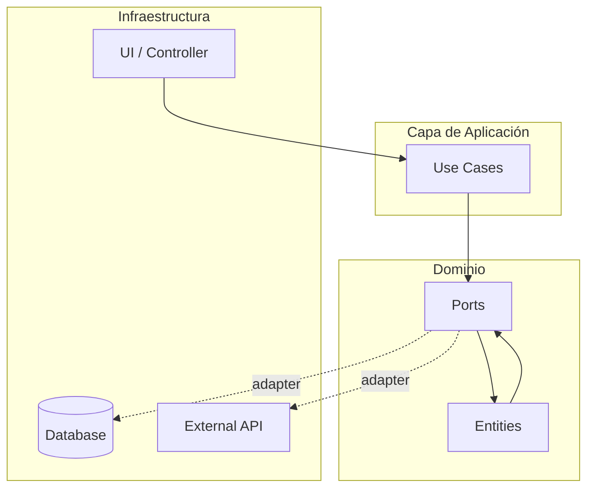

# 🏗️ Módulo G6 — Design.md — Arquitectura, Mermaid y ADR-lite

## Misión

Crear `design.md` con la arquitectura de la aventura, diagramas Mermaid y decisiones
técnicas documentadas. Usa el informe del explorador de dominio/arquitectura como base
(Théoden del Dominio en modo clásico, o el agente asignado del team si `GANDALF_TEAM` activo).
Sin planos, los cimientos se hunden.

---

## Paso 0 — Pre-carga de contexto

Leer del `contexto_rohirrim` la arquitectura detectada (explorador de dominio:
Théoden del Dominio en modo clásico, o el agente asignado del team con su nombre de lore
si `GANDALF_TEAM` activo — ver tabla de mapping en `01-module-rohirrim.md`).
Si existe `requirements.md`, leerlo para alinear el diseño con los requisitos.

Si `contexto_docs` está disponible: usar la documentación oficial del stack
para alinear el diseño con los patrones y convenciones oficiales de cada tecnología.

---

## Paso 1 — Visión general

Preguntar si el usuario quiere confirmar o ajustar la arquitectura detectada:

```
⚡ "[explorador de dominio] reportó la siguiente arquitectura:"

  🏰 Tipo de app:    [app_type del explorador de dominio]
  🏛️  Patrón:        [architecture_pattern del explorador de dominio]
  📦 Módulos:       [lista de módulos]
  🖥️  Frontend:      [sí/no — tipo]
```

**Nombre del explorador de dominio**: Si `GANDALF_TEAM` activo, usar el nombre real
del agente asignado + su nombre de lore (ej: `php-pro (Frodo Bolsón)`).
Si no hay team, usar `Théoden del Dominio`.

AskUserQuestion:
```json
{
  "questions": [{
    "header": "Arquitectura — Paso 1",
    "question": "⚡ ¿Confirmamos esta arquitectura o la ajustamos?",
    "multiSelect": false,
    "options": [
      {
        "label": "✅ Confirmar — [explorador de dominio] la mapeó bien",
        "description": ""
      },
      {
        "label": "✏️  Ajustar arquitectura",
        "description": "Modificar patrón, módulos o tipo de app"
      },
      {
        "label": "🏗️  Greenfield — elegir arquitectura nueva",
        "description": "Proyecto nuevo sin arquitectura previa"
      },
      {
        "label": "🔙 Volver al menú",
        "description": ""
      }
    ]
  }]
}
```

Si Greenfield o ajuste, preguntar qué patrón usar:
- Hexagonal (Ports & Adapters)
- MVC
- Clean Architecture
- Layered / N-tier
- Microservicios
- Monolito modular
- Otro (texto libre)

---

## Paso 2 — Diagrama Mermaid (SIEMPRE obligatorio)

Generar automáticamente un diagrama Mermaid según la arquitectura.

**Tipo de diagrama según caso**:
- Feature nueva en arquitectura existente → `sequenceDiagram` (flujo de la feature)
- Arquitectura nueva → `graph TD` (componentes y relaciones)
- Refactoring → `graph LR` (AS-IS vs TO-BE)
- Spike → `graph TD` (componentes a explorar)

Ejemplo para hexagonal:


Mostrar el diagrama generado y preguntar:
- ✅ Correcto
- ✏️ Ajustar (pedir qué cambiar)

---

## Paso 3 — Componentes

Listar los componentes principales del diseño con:
- Nombre
- Responsabilidad (1 frase)
- Dependencias
- Interfaz pública (endpoints, métodos clave o eventos)

Inferir de los módulos del explorador de dominio (Théoden o agente del team) + los requisitos de G5.
Revisar uno a uno con el patrón estándar (✅/✏️/⏭️/🚫).

---

## Paso 4 — Decisiones técnicas (ADR-lite)

**Mínimo 2 ADRs por SDD**, siempre:

Formato de cada ADR:
```
### ADR-[N] — [Título de la decisión]

**Elegido**: [opción escogida]
**Descartado**: [alternativas no elegidas]
**Motivo**: [1-2 frases del por qué]
**Consecuencias**: [qué implica esta decisión]
```

Inferir ADRs automáticamente según el stack Rohirrim. Ejemplos:
- ADR sobre elección de ORM (si hay múltiples opciones)
- ADR sobre estrategia de tests
- ADR sobre patrón de arquitectura
- ADR sobre gestión de estado (frontend)
- ADR sobre estrategia de autenticación

Revisar ADRs con el patrón estándar.

---

## Paso 5 — Consideraciones de seguridad (SIEMPRE presente)

Sección obligatoria, inferida del stack y requisitos:
- Autenticación y autorización (si hay auth en el sistema)
- Validación de inputs
- Datos sensibles y almacenamiento
- Dependencias y actualizaciones
- OWASP top 10 relevantes para el stack

---

## Paso 6 — Riesgos técnicos

Tabla: probabilidad × impacto × mitigación

| Riesgo | Prob. | Impacto | Mitigación |
|--------|-------|---------|------------|
| [riesgo inferido] | Alta/Media/Baja | Alto/Medio/Bajo | [acción] |

Mínimo 2 riesgos. Inferir del stack y la aventura descrita.

---

## Paso 7 — Preview y guardar

```
══════════════════════════════════════════════════════════════
🏗️  PREVIEW — design.md
══════════════════════════════════════════════════════════════
[contenido completo]
══════════════════════════════════════════════════════════════
```

AskUserQuestion: ✅ Guardar / ✏️ Ajustar / 🔙 Volver sin guardar

---

## Lore al guardar

```
══════════════════════════════════════════════════════════════
🏔️  LOS PLANOS DEL ARQUITECTO HAN SIDO SELLADOS
══════════════════════════════════════════════════════════════

  ⚡ Gandalf traza el último símbolo en el pergamino:
     "Los cimientos determinan la altura de la torre."

  🪓 Gimli: "¡Cuenta con mi hacha!"
     → La arquitectura está tallada en piedra de Khazad-dûm.

  📄 Fichero: [ruta]/design.md
  📊 Total:   [N] componentes · [M] ADRs · [K] riesgos

══════════════════════════════════════════════════════════════
```

---

## Post-generación — CTA de revisión adicional

Si `GANDALF_MODE=fast`: continuar directamente a G7 sin preguntar.
Si `GANDALF_MODE=review` o no definido: AskUserQuestion:
- ✅ Continuar a las tareas → G7
- 🔍 Revisar design.md generado → abrir el fichero para ajustes adicionales
- 🔙 Volver al menú sin continuar

---

## Transición

→ Cargar `@prompts/gandalf/sections/07-module-tasks.md`

---

**Módulo**: `06-module-design.md`
**Invocado desde**: `05-module-requirements.md` / `04-module-continue.md`
**Requiere**: Write, contexto_rohirrim, requirements.md (contexto)
