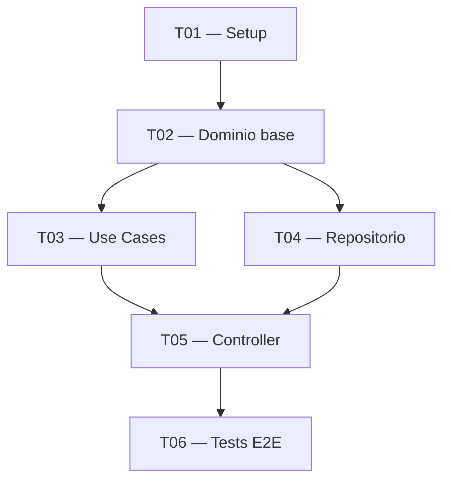

# 📝 Módulo G7 — Tasks.md — Desglose con Dependencias

## Misión

Generar `tasks.md` con tareas ordenadas por dependencias, cada una con acceptance
criteria concretos y verificables. El mapa del viaje, tarea a tarea.

---

## Paso 1 — Inferir tareas automáticamente

A partir de requirements.md + design.md + `contexto_rohirrim`, inferir tareas
organizadas por bloques de implementación. El orden es sagrado — Gondor no cae
en un día.

**Si `contexto_docs` está disponible**: incorporar las tareas de setup/configuración
recomendadas por la documentación oficial del stack (ej: estructura de carpetas
recomendada por Symfony, convenciones de naming de React, etc.).

**Bloques por tipo de aventura** (del G3):

| Tipo | Orden de bloques |
|------|-----------------|
| Nueva feature | Dominio → Aplicación → Infraestructura → UI → Tests → E2E |
| Greenfield | Setup → Core Domain → Infraestructura → API/UI → Deploy → Tests |
| Refactoring | Análisis AS-IS → Módulo por módulo → Tests regresión → Validación |
| Spike | Setup experimento → Exploración → Métricas → Conclusiones |

---

## Paso 2 — Revisión

```json
{
  "questions": [{
    "header": "Tareas generadas",
    "question": "⚡ ¿Cómo revisamos las tareas?",
    "multiSelect": false,
    "options": [
      {
        "label": "✅ Aprobar todas — el plan está bien",
        "description": "Aceptar todas las tareas inferidas"
      },
      {
        "label": "🔍 Revisar una a una",
        "description": "Patrón estándar: aprobar / modificar / saltar / cancelar"
      },
      {
        "label": "✏️  Editar manualmente",
        "description": "Modificar el listado completo de forma libre"
      },
      {
        "label": "🔙 Volver al menú",
        "description": ""
      }
    ]
  }]
}
```

---

## Paso 3 — Revisión uno a uno

Si elige revisar una a una, usar el patrón estándar:

```
══════════════════════════════════════════════════════════════
📝 TAREA [X/N]
══════════════════════════════════════════════════════════════

  🏷️  T[XX] — [Título de la tarea]
  📏 Tamaño:   [S / M / L / XL]
  🔗 Depende:  [T01, T02 / ninguna]

  [Descripción técnica de 2-3 frases]

  Criterios de aceptación:
  - [ ] [criterio concreto y verificable 1]
  - [ ] [criterio concreto y verificable 2]
  - [ ] [criterio concreto y verificable 3]

══════════════════════════════════════════════════════════════
```

AskUserQuestion: ✅ Aceptar / ✏️ Modificar / ⏭️ Saltar / 🚫 Cancelar todo

**REGLAS de los acceptance criteria**:
- Mínimo 2 por tarea
- Concretos y verificables: NO usar "funciona correctamente", "se implementa bien"
- SÍ usar: "El endpoint devuelve 201 con el ID creado", "Los tests unitarios cubren los 3 casos edge"
- No predecir horas ni días — solo S/M/L/XL

**Tamaños**:
- S = tarea simple, un componente, sin dependencias complejas
- M = tarea media, 1-2 componentes interactuando
- L = tarea compleja, múltiples componentes o incertidumbre técnica
- XL = épica que debería descomponerse más (sugerir al usuario)

---

## Paso 4 — Grafo de dependencias

Siempre incluir al final del fichero un grafo de dependencias en Mermaid:



---

## Paso 5 — Resumen por tamaño

```
📊 Resumen del viaje:
  S: [N] tareas  (avance rápido)
  M: [N] tareas  (ritmo de La Comunidad)
  L: [N] tareas  (batallas importantes)
  XL: [N] tareas (considera descomponer)

  Total: [N] tareas · Tamaño estimado: [suma ponderada]
```

---

## Paso 6 — Preview y guardar

AskUserQuestion: ✅ Guardar / ✏️ Ajustar / 🔙 Volver sin guardar

**Ruta por defecto**: misma carpeta que requirements.md y design.md

---

## Lore al guardar

```
══════════════════════════════════════════════════════════════
🗺️  EL MAPA DEL VIAJE HA SIDO TRAZADO
══════════════════════════════════════════════════════════════

  ⚡ Gandalf despliega el pergamino sobre la mesa del Consejo:
     "Cada tarea es un paso en el camino. Ninguno se salta."

  🏹 Legolas: "¡Y con mi arco!"
     → Cada tarea, una flecha que nunca yerra el destino.

  📄 Fichero: [ruta]/tasks.md
  📊 Total:   [N] tareas ([S: x · M: x · L: x · XL: x])

══════════════════════════════════════════════════════════════
```

---

## Post-generación — CTA de revisión adicional

Si `GANDALF_MODE=fast`: mostrar los 3 lores de guardado (requirements + design + tasks) de forma consecutiva y continuar a G8.
Si `GANDALF_MODE=review` o no definido: AskUserQuestion:
- ✅ Continuar al Consejo Final → G8
- 🔍 Revisar tasks.md generado → abrir el fichero para ajustes adicionales
- 🔙 Volver al menú sin continuar

---

## Transición

→ Cargar `@prompts/gandalf/sections/08-module-council.md`

---

**Módulo**: `07-module-tasks.md`
**Invocado desde**: `06-module-design.md` / `04-module-continue.md`
**Requiere**: Write, requirements.md (contexto), design.md (contexto)
